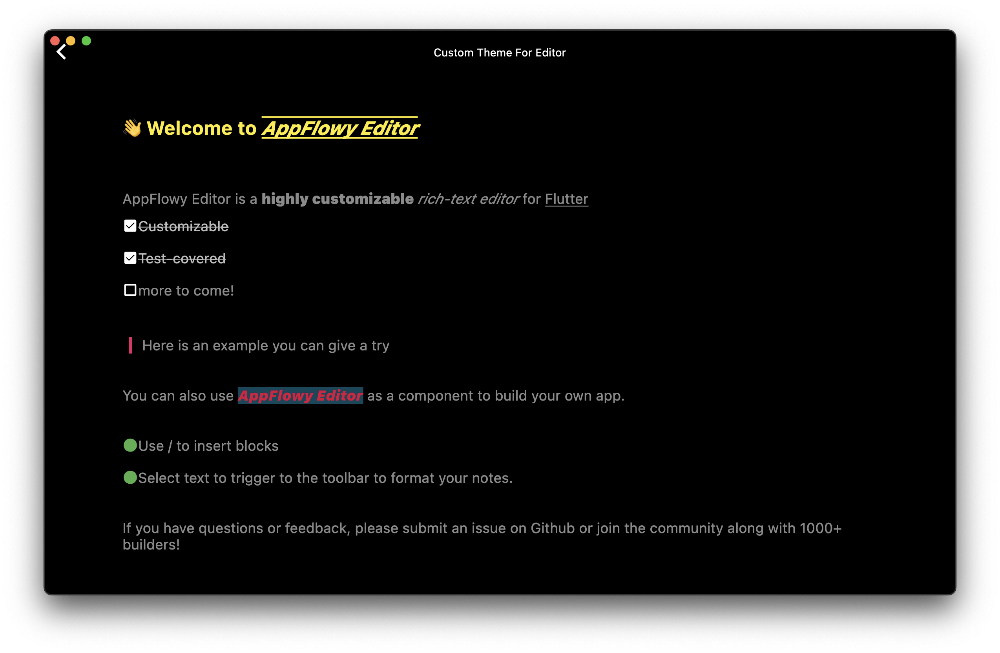

# Customizing Editor Features

## Customizing a Shortcut Event

We will use a simple example to illustrate how to quickly add a shortcut event.

In this example, text that starts and ends with an underscore ( \_ ) character will be rendered in italics for emphasis.  So typing `_xxx_` will automatically be converted into _xxx_.

Let's start with a blank document:

```dart
import 'package:appflowy_editor/appflowy_editor.dart';
import 'package:flutter/material.dart';

class UnderScoreToItalic extends StatelessWidget {
  const UnderScoreToItalic({super.key});

  @override
  Widget build(BuildContext context) {
    return AppFlowyEditor.custom(
      editorState: EditorState.blank(withInitialText: true),
      blockComponentBuilders: standardBlockComponentBuilderMap,
      characterShortcutEvents: const [],
    );
  }
}
```

At this point, nothing magic will happen after typing `_xxx_`.


To implement our shortcut event we will create a `CharacterShortcutEvent` instance to handle an underscore input.

We need to define `key` and `character` in a `CharacterShortcutEvent` object to customize hotkeys. We recommend using the description of your event as a key. For example, if the underscore `_` is defined to make text italic, the key can be 'Underscore to italic'.


```dart
import 'package:appflowy_editor/appflowy_editor.dart';
import 'package:flutter/material.dart';

// ...

CharacterShortcutEvent underscoreToItalicEvent = CharacterShortcutEvent(
  key: 'Underscore to italic',
  character: '_',
  handler: (editorState) async => handleFormatByWrappingWithSingleCharacter(
    editorState: editorState,
    character: '_',
    formatStyle: FormatStyleByWrappingWithSingleChar.italic,
  ),
);
```

Now our 'underscore handler' function is done and the only task left is to inject it into the AppFlowyEditor.

```dart
import 'package:appflowy_editor/appflowy_editor.dart';
import 'package:flutter/material.dart';

class UnderScoreToItalic extends StatelessWidget {
  const UnderScoreToItalic({super.key});

  @override
  Widget build(BuildContext context) {
    return AppFlowyEditor.custom(
      editorState: EditorState.blank(withInitialText: true),
      blockComponentBuilders: standardBlockComponentBuilderMap,
      characterShortcutEvents: [
        underScoreToItalicEvent,
      ],
    );
  }
}

CharacterShortcutEvent underScoreToItalicEvent = CharacterShortcutEvent(
  key: 'Underscore to italic',
  character: '_',
  handler: (editorState) async => handleFormatByWrappingWithSingleCharacter(
    editorState: editorState,
    character: '_',
    formatStyle: FormatStyleByWrappingWithSingleChar.italic,
  ),
);
```


Check out the [complete code](https://github.com/AppFlowy-IO/appflowy-editor/blob/main/example/lib/samples/underscore_to_italic.dart) file of this example.


## Customizing a Theme

We will use a simple example to illustrate how to quickly customize a theme.

Let's start with a blank document:

```dart
@override
Widget build(BuildContext context) {
  return Scaffold(
    body: Container(
      alignment: Alignment.topCenter,
      child: AppFlowyEditor(
        editorState: EditorState.blank(),
      ),
    ),
  );
}
```

At this point, the editor looks like ...


Next, we will customize the `EditorStyle` and the block style with `BlockComponentConfiguration`.

```dart
EditorStyle customizeEditorStyle() {
  return EditorStyle(
    padding: PlatformExtension.isDesktopOrWeb
        ? const EdgeInsets.only(left: 100, right: 100, top: 20)
        : const EdgeInsets.symmetric(horizontal: 20),
    cursorColor: Colors.green,
    selectionColor: Colors.green,
    textStyleConfiguration: TextStyleConfiguration(
      text: const TextStyle(
        fontSize: 18.0,
        color: Colors.white54,
      ),
      bold: const TextStyle(
        fontWeight: FontWeight.w900,
      ),
      href: TextStyle(
        color: Colors.amber,
        decoration: TextDecoration.combine(
          [
            TextDecoration.overline,
            TextDecoration.underline,
          ],
        ),
      ),
      code: const TextStyle(
        fontSize: 14.0,
        fontStyle: FontStyle.italic,
        color: Colors.blue,
        backgroundColor: Colors.black12,
      ),
    ),
    textSpanDecorator: (context, node, index, text, textSpan) {
      final attributes = text.attributes;
      final href = attributes?[AppFlowyRichTextKeys.href];
      if (href != null) {
        return TextSpan(
          text: text.text,
          style: textSpan.style,
          recognizer: TapGestureRecognizer()
            ..onTap = () {
              debugPrint('onTap: $href');
            },
        );
      }
      return textSpan;
    },
  );
}

Map<String, BlockComponentBuilder> customBuilder() {
  final configuration = BlockComponentConfiguration(
    padding: (node) {
      if (HeadingBlockKeys.type == node.type) {
        return const EdgeInsets.symmetric(vertical: 30);
      }
      return const EdgeInsets.symmetric(vertical: 10);
    },
    textStyle: (node) {
      if (HeadingBlockKeys.type == node.type) {
        return const TextStyle(color: Colors.yellow);
      }
      return const TextStyle();
    },
  );

  // customize heading block style
  return {
    ...standardBlockComponentBuilderMap,
    // heading block
    HeadingBlockKeys.type: HeadingBlockComponentBuilder(
      configuration: configuration,
    ),
    // todo-list block
    TodoListBlockKeys.type: TodoListBlockComponentBuilder(
      configuration: configuration,
      iconBuilder: (context, node) {
        final checked = node.attributes[TodoListBlockKeys.checked] as bool;
        return Icon(
          checked ? Icons.check_box : Icons.check_box_outline_blank,
          size: 20,
          color: Colors.white,
        );
      },
    ),
    // bulleted list block
    BulletedListBlockKeys.type: BulletedListBlockComponentBuilder(
      configuration: configuration,
      iconBuilder: (context, node) {
        return const Icon(
          Icons.circle,
          size: 20,
          color: Colors.green,
        );
      },
    ),
    // quote block
    QuoteBlockKeys.type: QuoteBlockComponentBuilder(
      configuration: configuration,
      iconBuilder: (context, node) {
        return const EditorSvg(
          width: 20,
          height: 20,
          padding: EdgeInsets.only(right: 5.0),
          name: 'quote',
          color: Colors.pink,
        );
      },
    ),
  };
}
```

Now our 'customize style' function is done and the only task left is to inject it into the AppFlowyEditor.

```dart
@override
Widget build(BuildContext context) {
  return Scaffold(
    body: Container(
      alignment: Alignment.topCenter,
      child: AppFlowyEditor(
        editorState: EditorState.blank(),
        editorStyle: customizeEditorStyle(),
        blockComponentBuilders: customBuilder(),
      ),
    ),
  );
}
```



## Changing default text direction

The text direction is LTR by default, but you can change it by wrapping AppFlowyEditor with Directionality.

In code snippet below we set the default direction to RTL.

```dart
@override
Widget build(BuildContext context) {
  return Scaffold(
    body: Directionality(
      textDirection: TextDirection.rtl,
      child: AppFlowyEditor(
        editorState: EditorState.blank(),
      ),
    ),
  );
}
```
